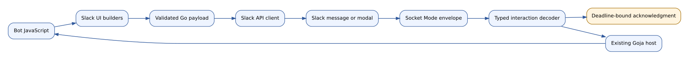
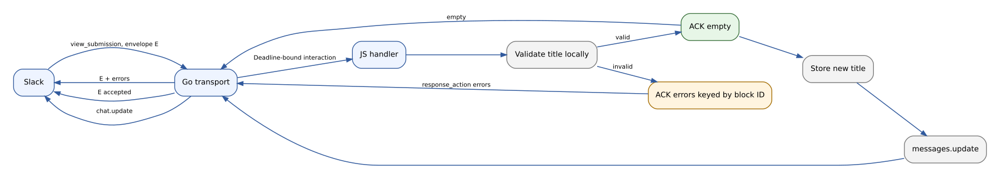

# Slack surfaces and a pragmatic native UI DSL

## 1. What we are building

A Slack bot is a program that receives events from Slack and calls Slack APIs to respond. Our program runs locally in Go. Bot authors write JavaScript, which the Goja interpreter executes inside that program. Today, the Slack host accepts slash commands and mentions and can send text. The proposed UI work adds structured messages and user interactions to this same host.

A **surface** is a place in the Slack client where content appears: a conversation message, a modal dialog, or a user's App Home tab, for example. **Block Kit** is Slack's JSON vocabulary for describing much of that content. A block describes a layout unit; an element describes something inside a block, such as a button; a composition object describes a reusable value, such as formatted text. A **DSL**, or domain-specific language, is the small JavaScript API that helps bot authors construct these JSON payloads correctly.

The existing Discord DSL is useful inspiration because it constructs typed values in Go while presenting a readable JavaScript API. Slack needs its own payloads, layout rules, and event handlers. The recommendation is a small native module, proposed as `require("slack/ui")`, alongside the existing `require("slack")` module. It should start with messages, buttons, static selects, and a simple modal. App Home is a short follow-up once those pieces work. The broader surface survey below is a reference for later work, not an implementation commitment.

Consider a bot that presents one saved note. It sends a message with the note title and an **Edit** button. Clicking Edit delivers a Slack interaction containing the button's identifier and a short-lived permission to open a modal. The bot opens a title field. Submitting it delivers another interaction; the bot either reports a field error immediately or accepts the submission and updates the message. This example establishes the complete path we need before adding more components.



An **acknowledgment**, abbreviated ACK, tells Slack that an interaction was received. For a modal submission it can also contain field errors or a replacement view. It is distinct from posting a message with the Web API. Getting that distinction right is necessary even for one person running one local bot.[^socket][^interactivity]

### Scope and engineering budget

This is a design at repository revision `5c700b2`, with `slack-go/slack v0.17.3`. All APIs marked **proposed** are sketches, not installed functionality. The first useful result is the note editor described above, with an offline test and a real Slack demonstration.

Use the existing process, configuration, credentials store, runtime owner, and HTTP client. This ticket covers the first seven layers of the proposed progression: raw Block Kit block values, small JavaScript helpers, rich outbound messages, action routing, one basic modal flow, typed Go-owned builders, and deadline-aware ACK handling. Layer eight—an interaction scheduler or separate worker-execution policy—is explicitly deferred. Keep state in the existing process-local store for the example. Do not add a database, durable queue, distributed lock, declarative workflow interpreter, generated schema pipeline, or cross-platform compatibility layer. A restart may invalidate an old edit screen; a clear “reopen the editor” response is sufficient. Detailed documentation should reduce implementation uncertainty rather than increase the implementation's scope.

## 2. Read the current system first

The following file references are relative to the `discord-bot` repository root. Line numbers refer to the baseline revision; symbol names remain useful after edits. Relevant copies are saved under `sources/code/` in this ticket.

| File and starting point | What it teaches |
|---|---|
| `cmd/slack-bot/main.go` | Cobra command assembly, process context, logging, and embedded help. |
| `pkg/slackcli/commands.go:243`, `Manifest` | Bot declarations become Slack app configuration. |
| `pkg/slackbot/model.go:26`, `Text`; `:60`, `Invocation` | The current small SDK-independent domain contract. |
| `pkg/slackbot/ingress.go:103`, `Admit` | Admission, filtering, in-memory deduplication, queueing, and acknowledgment. |
| `internal/slacktransport/run.go`, `decode` | Only mentions and slash commands become invocations today. |
| `internal/slacktransport/client.go`, `Post` | Outbound text goes through the Slack SDK. |
| `internal/jsslack/host.go:150`, `RegisterRuntimeModule` | Native module registration and runtime ownership. |
| `internal/jsslack/module.go:15`, `decode` | JSON boundary rejects unknown fields rather than reflecting arbitrary Go objects. |
| `internal/jsslack/dispatch.go:30`, `Dispatch` | Whole-invocation serialization, timeouts, handler return values, and promises. |
| `examples/slack-bots/slack.d.ts` | Complete current JavaScript contract. |

The current `Text` type requires 1–4000 Unicode code points. That is our host policy, not a universal Slack limit. `PostMessage` carries channel, text, and optional thread timestamp. A slash-command reply uses a Go-owned response URL and is ephemeral; a mention reply posts into the mention's existing thread or starts a thread under that mention. Arbitrary blocks fail the current strict decoder. Adding a builder alone therefore cannot make rich messages work.

`Invocation.Validate` currently requires a channel for every invocation and permits exactly one command or `app_mention` event. A modal submission or global shortcut need not have a channel. The UI work must change this validation by invocation kind rather than invent a channel ID to satisfy it. The transport also currently discards `trigger_id`, which is needed to open a modal.

Ingress calls `admit` before `Ack`. The queue worker can begin executing before the acknowledgment is sent. The current architecture separates acknowledgment from handler completion, but it does not establish a strict ACK-before-handler barrier. Unsupported interactive envelopes are acknowledged and dropped. This behavior must be changed deliberately for submissions and option loading.

### Runtime ownership and the invocation gate

Goja values belong to a runtime and must be accessed through its owner. The existing host creates promises on that owner, runs network work outside it, and returns to the owner to resolve or reject them. Builders should follow the same rule: construct and validate on the owner, then pass detached Go data to the service goroutine. Never retain `goja.Value`, a Proxy, or a reflected mutable object in an HTTP request worker.

The host also has a separate gate around an entire invocation. This means a handler awaiting network I/O can hold the gate while the owner itself is free. The initial implementation keeps that existing serial execution model. ACK handling remains deadline-aware, but this ticket does not add an interaction scheduler, worker reservation, priority policy, or special execution budget. If serial execution later proves inconvenient, concurrency can be redesigned as a separate change with its own measurements and tests. The vault's runtime-ownership article explains the owner pattern; the pinned host source determines the exact APIs available here.[^owner]

## 3. What carries over from the Discord DSL

The Discord module registers `require("ui")` and exports `message`, `embed`, `button`, several select builders, `form`, and helpers such as `row`, `pager`, `actions`, `confirm`, `card`, and `flow`. Its builders use `goja.Proxy` property traps. Each chain method mutates a Go builder and returns the receiver. `.build()` produces a Go payload consumed by the Discord normalization layer.

Read `internal/jsdiscord/ui_module.go:34`, `ui_message.go:27`, `ui_components.go:42`, `ui_form.go:22`, and `payload_model.go:184`. `ui_errors.go` provides useful wrong-parent and unknown-method diagnostics. `ui_phase34_test.go` demonstrates the expected user-facing chain behavior. These patterns are reusable ideas; their Discord SDK types are not Slack domain types.

| Discord feature | Slack treatment | Reason |
|---|---|---|
| Message builder | Reuse the construction pattern with `text` and `blocks`. | Slack uses Block Kit, not embeds plus component rows. |
| Embed and card helper | Compose section, context, image, and actions blocks first. | A Discord embed's color, footer, and fields do not have a lossless mapping. |
| Button `customId` | Stable `action_id` plus a separate `value`. | Routing and record identity can remain separate. |
| Five-button rows | Slack `actions` blocks with Slack limits. | Discord row limits do not apply. |
| Disabled pager buttons | Omit unavailable actions or show noninteractive page text. | The ordinary Slack button reference has no `disabled` property. |
| Static select | Slack static-select options and selected-option shape. | Slack allows different limits and emits different state. |
| User/channel select | Users, public channels, or conversations select, chosen explicitly. | Conversations can include private channels and direct messages. |
| Role/mentionable select | No automatic equivalent. | Discord roles are not Slack selectable entities of the same kind. |
| Text form | Modal view containing input blocks and text-input elements. | Slack uses `block_id`, `action_id`, and `callback_id`. |
| Confirmation message | Prefer Slack's confirm composition object for a single action. | It requires less application state. |
| `flow` | Optional ID helper much later. | Current `newFlowHelper` at `ui_helpers.go:271` only produces namespaced IDs. |
| Message `.file` | Separate file-upload service when needed. | The current Discord builder stores a nil reader and discards content; do not copy this placeholder. |
| Ephemeral/follow-up flags | Explicit Slack delivery operations. | Ephemeral messages and response URLs have different lifecycle rules. |

Two implementation details deserve restraint. First, a Proxy is optional: explicit wrapper methods can provide fluent builders without intercepting every property lookup. Use ordinary methods initially; descriptive validation errors matter more than reproducing the trap mechanism. Second, `.build()` should produce a detached JSON-compatible snapshot. This fits the Slack host's existing strict JSON decoder and makes fixture comparison straightforward. The builder remains Go-owned; the exported snapshot does not expose its mutable Go fields.

Message block IDs should change with each message revision, while modal input IDs stay stable across updates that should preserve values. The sample uses a small note revision counter for the message action block. Neither scheme requires a framework-wide ID registry.

A later builder mutation must not change an already built payload. Test this with one nested button and one modal field. If using a Proxy, verify that inspection, JSON serialization, and Promise checks of `then` do not trigger erroneous “unknown method” failures. The Discord implementation is evidence to study, not a guarantee that each convenience is already complete.

## 4. Slack's surface model

Slack's current catalog names App Home, canvases, lists, messages, modals, and split view. Work Objects add rich link previews and detail views. Files and link unfurls are also important output mechanisms. The framework currently supports only a small text subset of messages. None of the Block Kit builders, action routing, modal methods, Home publication, canvases, lists, or agent lifecycle handlers is currently exposed.[^surfaces]

| Surface or mechanism | Content and lifecycle | Recommendation |
|---|---|---|
| Conversation message | `chat.postMessage`; update by channel and string `ts`. Blocks and fallback text. | First slice. |
| Ephemeral message | Visible to a specified user; delivery and persistence differ from regular messages. | Keep current slash replies; add explicit API only for a use case. |
| Modal | Opened through a user interaction; up to three views in a stack. | Basic open, submit, field errors next. |
| App Home tab | Per-user view published with `views.publish`; opened event can trigger refresh. | Next small feature after modal primitives. |
| Canvas | Document API with markdown content; no Block Kit. | Separate service later. |
| List | Slack-managed schema and items; creation requires a paid workspace. | Separate service later. |
| Split view / agent conversation | Agent feature, conversation events, status, streaming, and session lifecycle. | Separate bot example and service work. |
| Work Object | Entity-aware unfurl and requested details tied to external records. | Only when a concrete record system needs it. |
| File upload | Allocate upload URL, upload bytes, complete upload. | Separate transport capability. |

### Messages and accessibility

A block message should have top-level `text` that conveys its essential information to notifications and screen readers. Slack can attempt to derive fallback text when it is absent, but our first builder should require an explicit fallback. This is a small predictable policy: the note editor's fallback could be “Note: Meeting notes. Use Edit to change the title.” Images require useful alternative text. Do not rely on a colored button or emoji alone to communicate state.[^post]

Keep message timestamps as strings. They are identifiers, not floating-point numbers. `chat.update` addresses a normal message by `channel` and `ts`; it cannot update an ephemeral message. When updating content, send the complete intended blocks and fallback text so that omitted-versus-empty API semantics do not accidentally preserve old content. An empty block array explicitly removes blocks. Only update messages the app is permitted to edit.[^update]

A response URL is a temporary response capability supplied by Slack. It can support several responses within its documented lifetime—up to five within thirty minutes—but the framework's current one-implicit-reply rule is narrower. UI work need not remove that rule to support a useful editor. Keep response URLs in Go, and add explicit replacement operations only if the example needs them. `chat.postEphemeral` is not a durable private-message store, and its return timestamp is not interchangeable with a normal editable message reference.[^interactivity][^ephemeral]

### Four text representations

`plain_text` is literal display text used by labels and many controls. `mrkdwn` is Slack-specific formatting inside a text object. `rich_text` is a structured tree with sections, lists, quotes, and preformatted nodes. The newer `markdown` block accepts standard Markdown and currently belongs to messages. These are separate wire formats, not four spellings of one parser.

The first API should expose `ui.plain(text)` and `ui.mrkdwn(text)` and require the appropriate kind where Slack restricts it. A button label is plain text. A section body may be mrkdwn. Do not silently feed Discord Markdown into every Slack field. Add a Markdown block builder only when there is a document-oriented output case; its aggregate limit is 12,000 characters and its `block_id` is ignored. Rich-text support should start with a narrow explicit structure rather than an arbitrary HTML renderer.[^text][^markdown][^richtext]

### Block compatibility: current catalog

The table below records the browser-rendered Slack catalog captured for this ticket.[^catalog] “Message”, “Modal”, and “Home” indicate documented placement, not that the current Go SDK or our framework implements the block. The raw HTML, rendered text, and Defuddle conversion are retained because the initial static extraction omitted these rows.

| Block | Message | Modal | Home | Planned treatment |
|---|:---:|:---:|:---:|---|
| section, divider, header, context, image | Yes | Yes | Yes | Core composition; implement only needed builders initially. |
| actions | Yes | Yes | Yes | Buttons and selects. |
| input | Yes | Yes | Yes | Initially restrict our form API to modals; this is a product subset. |
| rich_text | Yes | Yes | Yes | Later structured text. |
| video | Yes | Yes | Yes | Later; special permission and URL requirements. |
| file | Yes | No | No | Remote-file display, not file upload. |
| markdown | Yes | No | No | Later long-form output. |
| table | Yes | No | Yes | Later tabular output; pinned SDK lacks its type. |
| data_table | Yes | No | Yes | Later interactive table. |
| data_visualization | Yes | No | Yes | Later charts. |
| card | Yes | Yes | Yes | Later; reference schema conflicts need verification. |
| carousel, container | Yes | No | Yes | Later grouped layouts. |
| alert | No | Yes | No | Later modal notice. |
| context_actions, task_card, plan | Yes | No | No | Later feedback and agent progress. |

The catalog permits inputs in messages and Home. That does not create a modal-style Submit event there. Input actions depend on the element's dispatch behavior and the containing block's `dispatch_action`; the application must decide how and when to save. A modal has an explicit submission lifecycle and is the simpler first data-entry surface.[^input][^actions]

The core interaction elements are buttons, static and external selects, multi-selects, checkboxes, radio groups, overflow menus, and date/time controls. Email, number, URL, and file inputs have more constrained placement; inspect the captured element catalog before exposing them. Built-in user and conversation selectors let Slack provide visible choices without implementing a directory API. External selects send `block_suggestion` requests that require an options response within the interaction deadline.[^select][^suggestions]

### Newer blocks: useful, but not a prerequisite

A `table` supports at most 100 rows and 20 cells per row, with a 10,000-character aggregate table-content limit. A `data_table` adds sorting and pagination, requires a caption, accepts 2–201 rows including the header, and has different aggregate limits. A `data_visualization` represents pie, bar, area, or line charts; the reference limits messages to two such blocks. These features can simplify a future reporting bot, but should not complicate a note editor.[^table][^datatable][^chart]

Task cards describe an individual task's status, details, output, and sources; plan blocks group related tasks. Context actions provide feedback or icon buttons. These are relevant to an eventual research assistant, not to basic form support. The pinned SDK includes `MarkdownBlock` but lacks native table and task-card types. The ticket's runnable SDK probe demonstrates that decoding either through `slack.Blocks` and marshaling again discards their fields, leaving only `type`. Never use the SDK's `UnknownBlock` as a lossless raw-data container.

For a future unsupported block, choose one deliberate implementation: upgrade the SDK if the target version actually supports it, or add a small typed transport struct that implements `slack.Block` and preserves its fields. The message API may accept a plain JSON-compatible `blocks` array as the low-level layer of this ticket, but it must remain inside the message/view payload boundary. Do not ship an unrestricted “call any Slack API with arbitrary JSON” command as a shortcut around all validation. No SDK upgrade is needed for the core slice.

### Documentation conflicts and availability

The current card reference calls several content fields strings, while the carousel examples encode text objects; it also describes card actions differently from the example array. The alert reference labels `level` as an array but its example uses a string. The canvas documentation expresses a content limit as both MiB and characters. These are concrete inconsistencies in the captured references. Do not convert them automatically into Go types. Check an official SDK implementation and a real API request before advertising those particular features.[^card][^carousel][^alert][^canvas]

The table reference's usage prose discusses messages while the rendered catalog also lists Home. Treat the Home placement as documented but not live-verified here. Availability of newer blocks and agent features has not been tested in the go-go-golems workspace. The first implementation relies on established messages and modals, whose behavior can be tested with the existing development app.

## 5. The interaction protocol determines the API

Slack Socket Mode delivers a WebSocket envelope containing an `envelope_id`, a payload, and `accepts_response_payload`. The outer envelope type can be `interactive`; the inner payload then identifies `block_actions`, `view_submission`, `view_closed`, `block_suggestion`, or a shortcut type. Do not confuse those two discriminators. For supported response-bearing interactions, send a Socket Mode acknowledgment containing the appropriate JSON payload.[^socket]

| Input | Route | Acknowledgment | Work afterward |
|---|---|---|---|
| `app_mention` | Event name | Empty ACK using existing ingress. | Post text or blocks. |
| Slash command | Command name | Empty ACK; existing response URL reply. | Open modal promptly if requested, or send response. |
| `block_actions` | Each relevant `action_id` | Empty ACK promptly. | Update message or open/update a modal. |
| `block_suggestion` | `action_id` | Options or option groups. | No delayed options response. |
| `view_submission` | `view.callback_id` | Empty to accept, or `errors`, `update`, `push`, `clear`. | Persist accepted values and update messages. |
| `view_closed` | `view.callback_id` | Empty ACK. | Optional cleanup. |
| Global shortcut | `callback_id` | Empty ACK. | Open modal with supplied trigger; channel may be absent. |
| Message shortcut | `callback_id` | Empty ACK. | Use selected message context and optional response capability. |
| `app_home_opened` | Event name and tab | Empty ACK. | Publish the user's Home view. |

A modal's `callback_id` identifies its handler. Its input block's `block_id` identifies a field container. The input element's `action_id` identifies the control. Submitted values are indexed by both block and action. A text input uses `value`; a users select uses `selected_user`; an option select uses `selected_option`. Preserve null and empty-array values—clearing a selection is a meaningful input.[^views]

```json
{
  "view": {
    "id": "V_EXAMPLE",
    "callback_id": "note.edit",
    "private_metadata": "{\"noteId\":\"n1\"}",
    "state": {
      "values": {
        "title": {
          "title_input": {"type": "plain_text_input", "value": "Meeting notes"}
        }
      }
    }
  }
}
```

This is a reduced illustrative payload, not a complete fixture. The proposed helper `ctx.values.text("title", "title_input")` should read precisely that path, returning a typed error for a mismatched element. Keep the full typed state accessible for less common controls; do not flatten all controls into strings.

### Deadlines and modal behavior

A trigger ID expires after approximately three seconds and can be exchanged once. Opening a modal therefore belongs near the start of the interaction handler. Acknowledge the button promptly, open a small modal immediately, and fetch optional expensive data afterward. A later view update can fill it in. Do not put an LLM call before `views.open`.[^interactivity][^open]

A view submission must be acknowledged within three seconds. Field errors are part of that acknowledgment and keyed by input **block IDs**. Sending an empty ACK first accepts the submission; a later message cannot reverse that decision or display validation errors in the same view. This is why the current universal empty-ACK path is insufficient.



For the first implementation, expose explicit acknowledgment on view handlers, and automatically empty-ack ordinary actions before their handler work. Use a single Go-owned acknowledgment object per envelope. It validates the response kind, guards against a second call, respects `accepts_response_payload`, and refuses use after expiry. Reuse the existing host gate. The handler must choose an ACK before Slack's deadline; the implementation does not reserve a separate worker or create a second execution path for interactive requests.

If the existing host gate delays a submission past the deadline, the ACK attempt fails and Slack shows its normal interaction failure. Do not fabricate an empty modal ACK, because that would accept data that was never processed. There is no separate busy response, worker pool, or scheduler in this ticket. For a local bot, the operator can retry the interaction or restart a stuck process.

Retries of response-bearing submissions deserve a small special case: the existing dedupe path ACKs duplicates with no semantic payload. Reuse its bounded in-memory storage to retain the chosen ACK JSON for a processed interactive envelope, or add a small adjacent map. Re-send the same ACK for a duplicate envelope and do not reapply the edit. An in-flight duplicate must not be empty-acked ahead of its validator. Do not dedupe independent clicks by `action_id`; the same button is legitimately used repeatedly. No durable exactly-once execution is promised across restart.

### Transport and handler pseudocode

The following is the intended control flow, not a new scheduling subsystem. Keep the current event/command ingress for ordinary work and add one interactive branch where an ACK body is required. The transport owns the receipt time and the ACK object; JavaScript never owns the raw socket.

```text
onSocketEnvelope(request):
    receivedAt = now()
    interaction = decodeKnownPayload(request)
    validateExpectedWorkspaceAndApp(interaction)

    if ordinaryEventOrCommand(interaction):
        useExistingIngress(interaction)
        return

    if cachedInteractiveACK(request.envelopeID):
        resendCachedACK(request.envelopeID)
        return

    if duplicateStillBeingValidated(request.envelopeID):
        return  // original worker owns the eventual semantic ACK

    if ordinaryBlockAction(interaction):
        sendEmptyACK(request.envelopeID)
        dispatchWithBoundedAdmission(interaction)
        return

    // Submission or external options: do not ACK before computing the body.
    // Dispatch through the existing host path. The ACK object enforces the
    // Slack deadline and rejects late or duplicate responses.
    ack = singleUseACK(request, receivedAt + slackInteractionDeadline)
    dispatchHandler(interaction, ack)
    if !ack.wasChosen():
        logMissingACK()
```

An ACK deadline is a property of the acknowledgment object, not a new handler execution budget. Before acknowledgment, expiry prevents a late response. After a successful ACK choice, the handler may continue its normal existing work timeout. Implement the single-use transition in Go so that a timeout and a handler cannot both choose a response. One small mutex or owner-serialized state transition is enough; do not create a reusable transaction framework. `AckCtx` returning successfully indicates SDK acceptance of the send request; a WebSocket fixture should verify the actual wire output.

For ordinary actions, choose either automatic acknowledgment or explicit acknowledgment and enforce that choice consistently. This guide chooses automatic ACK for actions and explicit ACK for submissions/options. `ctx.ack` must therefore not be available as a second acknowledgment path on an already-acknowledged action. A returned message remains an application reply, never an implicit substitute for a modal response action.

## 6. Proposed API: one complete note editor

All code in this section is **proposed API pseudocode**. Its purpose is to fix the boundary and provide an acceptance example; method names may change together during implementation. Keep one naming scheme, then update the TypeScript declarations and embedded help in the same change. The raw layer and helper layer should remain available even when typed builders are used, so an intern can compare the generated object with Slack's documented Block Kit JSON.

```javascript
const { defineBot } = require("slack");
const ui = require("slack/ui");

function noteMessage(note) {
  return ui.message(`Note: ${note.title}`)
    .block(ui.section(ui.mrkdwn(`*${note.title}*`)))
    .block(ui.actions(`note_actions_${note.revision}`,
      ui.button("note.edit", "Edit").value(note.id)))
    .build();
}

module.exports = defineBot(({ configure, command, action, view }) => {
  configure({ name: "notes" });

  command("/notes", { description: "Show a note" }, async ctx => {
    const note = { id: "n1", title: "Meeting notes", revision: 0 };
    const ref = await ctx.slack.messages.post({
      channelId: ctx.channelId, ...noteMessage(note)
    });
    ctx.store.set("note:n1", { ...note, ref });
  });

  action("note.edit", async ctx => {
    const note = ctx.store.get(`note:${ctx.action.value}`);
    if (!note) {
      if (ctx.respond) await ctx.respond({text: "Run /notes again."});
      else ctx.log.info("Editor expired; run /notes again.");
      return;
    }
    // The framework already acknowledged this ordinary button action.
    await ctx.openModal(
      ui.modal("note.edit", "Edit note")
        .metadata({ noteId: note.id })
        .input("title", "Title",
          ui.textInput("title_input").initial(note.title))
        .submit("Save")
        .build()
    );
  });

  view("note.edit", async ctx => {
    const title = ctx.values.text("title", "title_input").trim();
    const note = ctx.store.get(`note:${ctx.metadata.noteId}`);
    if (!note) return ctx.ack.errors({title: "Run /notes again to reopen."});
    if (title.length < 3) {
      return ctx.ack.errors({ title: "Use at least three characters." });
    }
    // Real bots also check whether this user may edit this record.
    await ctx.ack.accept();
    note.title = title;
    note.revision += 1;
    ctx.store.set(`note:${note.id}`, note);
    await ctx.slack.messages.update({ ...note.ref, ...noteMessage(note) });
  });
});
```

`ctx.respond` is available only when Slack supplied a response capability; the example's missing-note action must otherwise log or update an accessible source message. A production example should branch on that availability. Do not invent a channel for a modal context. For the first development bot, membership in the test channel can define who may edit; if records become user-specific, check the user ID in the handler before applying changes. An ID or `private_metadata` is routing data, not authorization and not encrypted storage.

The sample stores a normal posted message reference rather than a slash-command ephemeral reply. This makes `chat.update` behavior unambiguous. If the process restarts, the note map is empty and reopening the editor is acceptable. A notification that accepted work later failed should be best-effort; no durable job system is needed.

### Small data and service boundaries

Extend the existing Slack domain package rather than creating a general UI framework. The exact block representation can be a closed set of small JSON-tagged Go structs for the initial supported types. Keep Slack SDK conversion in the transport, following the current package boundary. Use a simple type switch for validation and conversion; generation is unnecessary for a handful of blocks.

```go
// Proposed abbreviated contracts; field tags and complete errors omitted.
type Message struct {
    Text   string
    Blocks []Block
}
type Modal struct {
    CallbackID string
    Title      PlainText
    Submit     *PlainText
    Blocks     []Block
    Metadata   string
}
type ViewRef struct { ID, Hash string }
type MessageService interface {
    Post(context.Context, PostMessage) (MessageRef, error)
    Update(context.Context, UpdateMessage) error
}
type ViewService interface {
    Open(context.Context, string, Modal) (ViewRef, error)
}
```

Add `Update` and `PublishHome` view methods only in the phase that uses them. Keep `trigger_id` in a Go-owned invocation capability behind `ctx.openModal`, with no need to put it in the public context. The same applies to response URLs. View IDs and hashes can be public data because handlers need them to request updates. Secrets remain in the existing credentials store; builders never receive tokens.

A tagged invocation model should distinguish command, event, action, suggestion, submission, close, and shortcut. It can be one struct with a `Kind` field and kind-specific nested structs; a generic event bus is unnecessary. Validate only fields required by that kind. Preserve action lists and relevant container information from Slack, then route supported actions explicitly. For a block action, the source can be a message or a view, so source-message updates must first check the container kind.

### Builder validation

Validate the constraints that prevent ordinary mistakes in the supported subset. A malformed local payload should fail before an HTTP request, with a path such as `modal.blocks[0].element.action_id`. Use Unicode code-point counts consistently and test non-ASCII input at boundaries. Do not silently truncate action IDs, metadata, or user input.

| Field or structure | Initial validation |
|---|---|
| Message | Require nonempty fallback text; keep the current 4000-character host policy explicit. Maximum 50 blocks. |
| Modal/Home | Maximum 100 blocks; reject blocks unsupported on that surface. |
| Modal title/submit/close | Plain text, each at most 24 characters. Submit required with inputs. |
| Section | Text up to 3000 characters; fields at most 10, each up to 2000. |
| Actions block | At most 25 elements; supported element kinds only. |
| Button | Plain-text label at most 75 characters; action ID at most 255; value at most 2000. No invented disabled flag. |
| Input | Explicit block ID and element action ID; optional/required belongs to the input block. |
| Plain-text input | Respect documented min/max bounds; max length at most 3000. |
| Static select | At most 100 options in the initial ungrouped API; initial option must match. |
| Metadata | JSON-encode once; at most 3000 characters for modal private metadata. |

These limits come from individual component references, not the generic text object's larger default. The first release can intentionally expose fewer elements and fields than Slack supports. That is preferable to advertising unchecked support for the whole catalog.[^section][^actions][^button][^inputtext][^modalview]

## 7. Implementation sequence and acceptance gates

Each phase should end with a working example and a focused commit. Update the detailed diary with actual commands, failures, and the resulting commit. The filenames below are suggested locations, not an instruction to create all of them immediately.

### Phase 1: Rich outbound messages

Extend `pkg/slackbot/model.go` or extract `messages.go` for the message payload and update request. Add initial block structs and validation in `pkg/slackbot/blocks.go`. Extend `internal/slacktransport/client.go` to convert supported blocks to SDK types and call `chat.update`. Update the JS reply/post decoder to accept blocks and use the same normalization for explicit replies and returned messages.

Implement `internal/jsslack/ui_module.go` and `ui_builders.go`, register `slack/ui` in the existing registrar, and expose the low-level plain-object message path alongside message, section, actions, button, and plain/mrkdwn constructors. Use one fixture showing a note title and button. Inspect the exact posted JSON offline and preview it with Block Kit Builder. At this checkpoint the button may be intentionally inert; document that clearly until Phase 2.

**Done when:** text-only ping still works, a returned rich message and an explicit rich post both serialize correctly, unknown fields fail usefully, and builder snapshots cannot be changed by later builder mutation.

### Phase 2: Button and select actions

Extend `internal/slacktransport/run.go` to decode `interactive` and normalize `block_actions`. Add action registration in `internal/jsslack/module.go`, kind-aware validation in the domain model, and action/container data in the JS context. Keep the existing identity checks. A channel allowlist should apply when an interaction has a channel; define the intended policy for channel-less views explicitly instead of accidentally dropping every modal.

Automatically acknowledge ordinary actions promptly, and dispatch them through existing local admission. Add a “mark reviewed” button that updates its source message. Then add a static select using the same path. Remove unavailable pagination buttons if adding pagination; do not fake a disabled property. No session abstraction is needed.

**Done when:** a button click routes once, two separate clicks both route, a duplicate envelope does not repeat the mutation, and a wrong app/workspace is rejected without invoking JavaScript.

### Phase 3: A complete modal edit

Preserve the command/action trigger capability; add `views.open`, modal/input/text-input builders, view registration, submitted state decoding, and a response-bearing ACK path. Implement the explicit `ctx.ack.accept()` and `ctx.ack.errors()` operations. Add the deadline and duplicate-ACK handling described above. Keep all promise settlement on the owner and use the existing invocation lifecycle.

Run the note-editor acceptance example. Test submission while another handler is slow: the modal must not be silently accepted on timeout. Keep the busy/retry limitation documented. Add `views.update` with the received hash only if the example actually requires background loading or a changed layout. Preserving the same input block/action IDs allows Slack to retain input values across view updates.[^modals]

**Done when:** valid edits update the message, invalid edits keep the modal open with the correct field error, stale process-local records ask the user to reopen, and an expired trigger or late ACK becomes a clear local diagnostic.

### Phase 4: Small independent additions

Add App Home when there is a dashboard to display: `app_home_opened`, a Home builder, `views.publish`, and the manifest Home flag. Filter the event's tab before publishing. Home is per user, so key example state by workspace and user. Add shortcuts when there is a useful entry point. Add external option loading only when a static selector is inadequate; it shares the response-bearing deadline path and should initially query local data.

**Done when:** the specific feature has a fixture, a manifest test, and a real interaction demonstration. Do not make all three additions prerequisites for finishing the note editor.

### Deferred, separately justified work

Canvases, Lists, Work Objects, file upload, streaming agent sessions, rich text composition, charts, and the newest containers each deserve a concrete bot use case. Keep them as optional ticket tasks. A future choice to support a new block should identify its exact surface, SDK serialization strategy, scopes, and one acceptance test before adding public methods.

## 8. CLI, manifests, credentials, and documentation

The UI module itself needs no new token. The existing app-level Socket Mode credential opens the connection, and the installed bot token authorizes Web API calls. Management credentials are relevant when changing app configuration; they are not message-send credentials. Do not copy any token into source fixtures, logs, the ticket, or JavaScript configuration.

The existing manifest builder already enables Socket Mode and interactivity. Action handlers do not require a separate event subscription for each button. App Home needs its feature flag and `app_home_opened`; shortcuts need manifest definitions and the `commands` scope. A new requested scope must actually be granted by installation before it can be used. Changing JavaScript does not automatically update an already-created Slack app's manifest.

At baseline, our CLI can generate and create manifests but does not have an existing-app manifest-update verb. Do not describe such a verb as available. For Phase 1–3, use the existing app with its already-enabled interactivity where possible. If Phase 4 requires new settings, either update them in the Slack dashboard or implement one explicit app-update command as a separately scoped task. Automatically reconciling every declaration against Slack on startup is unnecessary.

| Later capability | Configuration/permission boundary |
|---|---|
| Post/update ordinary messages | Installed bot `chat:write`; channel access still matters. |
| Shortcuts | `commands` plus callback definitions. |
| Home | Home tab enabled and `app_home_opened`; publish with installed bot token. |
| File upload | `files:write`; upload bytes and complete the upload. |
| Canvas creation | `canvases:write`; free-workspace channel limitations apply. |
| List creation | `lists:write`; paid workspace required. |
| Link unfurl/Work Objects | Domain registration, relevant link events and scopes; follow entity details requirements. |
| Video block | `links.embed:write` and documented URL requirements. |
| Agent experience | Agents feature and `assistant:write`, message/event permissions, current session lifecycle. |

Update `examples/slack-bots/slack.d.ts`, `pkg/slackdoc/slack-offline.md`, README quickstarts, and the showcase bot together. `bots inspect` should show action/view/shortcut declarations as they are added. Extend `bots simulate` to accept normalized UI fixture inputs and capture ACK payloads as well as outbound API operations. A new command family just for every block builder is unnecessary.

## 9. Testing that answers real questions

The source archive includes `scripts/02-run-sdk-probe.sh`. Run it from the repo root. It uses the existing top-level Go module and the pinned offline wrapper, creates a temporary main file, and removes it on exit. No Slack credentials or server are required.

```text
*slack.SectionBlock [{"type":"section","text":{"type":"mrkdwn","text":"hello"}}]
*slack.UnknownBlock [{"type":"table"}]
*slack.UnknownBlock [{"type":"task_card"}]
{"response_action":"errors","errors":{"title":"Enter a title"}}
```

This proves a specific SDK round-trip limitation and the modal-error wire shape. It does not prove Slack will accept every builder or that the SDK handles all new surface types. That narrower conclusion is enough to keep unsupported blocks out of the first implementation.

Use four levels of validation. Domain tests cover supported shape limits and ownership snapshots. JS-host tests load a real example and inspect normalized results, registration, errors, and late-context use. HTTP/WebSocket fixture tests use the actual SDK to check exact requests and ACK envelopes. Finally, a manual Slack demonstration validates rendering and interaction behavior, which a mock cannot establish.

| Scenario | What the assertion must establish |
|---|---|
| Rich return and explicit post | Both use the same validated content and fallback. |
| Input state | Text, selected option, null clearing, and arrays preserve their different shapes. |
| Invalid modal title | ACK has `response_action: errors` and the correct block ID; no message update occurs. |
| Valid submission | ACK precedes slow side effects; one store mutation and one message update. |
| Duplicate submission envelope | Same semantic ACK is returned; mutation is not repeated. |
| Busy gate / deadline | No false successful modal acceptance; canceled work cannot later mutate state. |
| Expired trigger | `views.open` fails clearly; no automatic replay with the same trigger. |
| Late retained context | ACK/open/reply calls fail after their allowed lifetime. |
| Wrong app/workspace | No JavaScript handler or side effect. |
| Hash conflict | Do not overwrite with stale view; report and let user refresh. |
| Builder mutation after build | Previously built payload remains unchanged, including nested arrays. |

Do not build a Slack renderer. Block Kit Builder and the real Slack client are the visual checks. Reuse the existing mock and fixtures where they help, but first inspect whether they implement submission ACKs, option responses, view hashes, and trigger expiry. A mock that accepts any JSON cannot validate these protocol properties. See the parent ticket's `design-doc/02-full-local-testing-plan-and-slack-mock-evaluation.md` for its earlier evaluation; UI support must be measured again against the new cases.

For future implementation, focused commands are `go test ./pkg/slackbot ./internal/jsslack ./internal/slacktransport ./pkg/slackcli`, followed by the project's required broader checks at a meaningful integration boundary. Use the offline wrapper when the workspace toolchain requires it. Run an interactive test bot in tmux and capture its output, following the repository guidelines. Do not restart the already-running ping bot merely to validate this document.

## 10. Optional surfaces in more detail

### App Home

App Home is a per-user app area; its Home tab contains a published view. It is not the app's Messages tab. Use `views.publish(user_id, view)` and optionally a hash to avoid stale replacement. The app can publish when it receives `app_home_opened` with the relevant tab, or after a task changes. Reuse blocks and button handlers, but do not reuse modal submission assumptions: Home has no modal Submit lifecycle.[^home][^publish]

A useful follow-up is a saved-notes list with an Edit button for each note. The user ID identifies the Home audience; it must not be inferred from a previously active channel. A process-local render-on-open implementation is sufficient initially. Background refresh schedules and persisted UI caches are unnecessary.

### Canvases and Lists

A canvas is a Slack document. Web API content uses `document_content: {type: "markdown", markdown: "..."}` rather than Block Kit. Creating or editing one belongs in `ctx.slack.canvases`, not in `ui.message().canvas()`. The current create reference allows a channel-associated canvas on free workspaces and distinguishes that from standalone canvas creation. Do not claim all canvas APIs are universally paid-only.[^canvascreate]

A List is a structured Slack object with schema fields and items. Its UI is managed by Slack. The useful framework abstraction would be create/read/update operations over list data, separate from a Block Kit table used only to present a report. `slackLists.create` requires `lists:write` and documents paid-workspace availability. Before adding this service, inspect the workspace plan and the operations the actual bot needs.[^lists]

### Work Objects and unfurls

A Work Object represents an external entity in Slack. Posting or observing a registered link can produce an entity-aware preview; opening details can request more entity information. This introduces external-reference identity and payloads beyond button callbacks. It is suitable for a ticket or knowledge-base integration when those records have stable links. Archive and read both the overview and implementation reference before attempting it; a generic card builder alone does not implement Work Objects.[^workobjects][^unfurl]

### Files and media

Uploading a file is not the same as adding an image block. The current file upload flow allocates an upload URL with `files.getUploadURLExternal`, sends bytes to that URL, and completes the upload with `files.completeUploadExternal`. Sharing and content metadata belong to the file service. An image block references an accessible image; a file block displays a remote file; a video block has additional permission and URL requirements. Keep these distinct in both API names and tests.[^upload][^complete][^video]

### Agent sessions, streaming, and split view

Slack's current agent documentation has moved beyond the older Assistant-only terminology. It describes an Agents feature, `agents.sessions.setStatus`, session rename/stop events, and a newer messaging experience. The migration guide marks the older experience as a migration target and explains a temporary compatibility bridge. For a new bot, use the current session design rather than importing older `assistant_thread_started` examples unquestioningly.[^agents][^migration]

This is separate from UI construction. A research assistant would need to receive message and session events, run its own work, update processing status, stream text, and eventually present sources or task cards. A future module can share message builders but should not turn a basic modal handler into an agent orchestration API. The sources include current streaming and status references so a later implementation can check the exact request parameters and availability.[^stream]

## 11. Decisions and remaining questions

### Decision: Slack-native API, familiar construction style

- **Context:** Discord builders mix useful ergonomics with Discord-specific payloads.
- **Options considered:** Direct translation, a cross-platform UI model, or a native Slack module.
- **Decision:** Propose `slack/ui` with Go-owned builders and detached snapshots.
- **Rationale:** It preserves the useful authoring pattern and keeps Slack constraints visible.
- **Consequences:** Bot UI code is rewritten deliberately; there is no compatibility promise.
- **Status:** Proposed.

### Decision: Implement a short complete interaction before breadth

- **Context:** The catalog is large, but the local bot needs a small working editor.
- **Options considered:** Full Block Kit coverage first, generic raw JSON, or a narrow typed subset.
- **Decision:** Messages, actions, and one modal form, followed by individually useful additions.
- **Rationale:** The interaction path is the highest-risk missing part and gives immediate value.
- **Consequences:** Unsupported blocks stay explicitly unsupported until a use case justifies them.
- **Status:** Proposed.

### Decision: Ship layers one through seven; defer execution scheduling

- **Context:** The UI DSL needs both a low-level Block Kit escape hatch and a correct interaction acknowledgment protocol.
- **Options considered:** Ship only fluent builders, ship raw objects without ACK support, or ship the raw/helper/builder layers together with ACK handling.
- **Decision:** Implement layers one through seven in this ticket. Explicitly defer layer eight, which would add a separate interaction scheduler, worker reservation, or priority execution policy.
- **Rationale:** Raw payloads make the first experiments possible, builders improve authoring, and ACK semantics are required by Slack itself. Scheduling addresses a different performance problem and is unnecessary for the local bot.
- **Consequences:** The existing host execution model remains in place. A late ACK fails normally; the framework does not manufacture a successful response or create a second worker system.
- **Status:** Proposed.

### Decision: Deadline-aware acknowledgments with existing execution

- **Context:** Slack imposes a short deadline; the host already serializes full invocations.
- **Options considered:** A scheduler redesign, worker reservation, or a single ACK object on the existing dispatch path.
- **Decision:** Keep the existing execution path and make the ACK object deadline-aware, single-use, and response-type aware.
- **Rationale:** ACK semantics are core Slack protocol behavior. A new scheduler is a separate performance problem and is unnecessary for the local bot.
- **Consequences:** A handler that misses the deadline fails normally and can be retried. No worker pool or priority policy is introduced.
- **Status:** Proposed.

The remaining questions are deliberately small: whether the first bot needs a static select; whether the public name should be `modal` or `form`; and whether a busy interaction is common enough to justify changing invocation concurrency. None blocks the research handoff. Newer component schema conflicts and workspace availability are explicit deferred verification tasks, not hidden assumptions in the core design.

## 12. Intern reading and implementation checklist

1. Run and inspect the existing ping bot locally through the documented CLI. Understand `reply`, `messages.post`, and the difference between management and runtime credentials.
2. Read `slack.d.ts`, `model.go`, and the transport decoder. Trace one mention from envelope to posted text.
3. Read the Discord message/button/form builders and normalization tests. Identify the reusable construction pattern and the platform-specific values.
4. Run the SDK probe and inspect why unknown blocks lose data.
5. Implement Phase 1 and inspect the exact outbound message JSON.
6. Add one button handler, then the modal's accepted and rejected paths.
7. Exercise the deadline and duplicate cases before adding more components.
8. Update TypeScript, embedded help, examples, tasks, and the diary with each completed phase.

## Sources and evidence

Official documentation was accessed on 2026-09-14 local time (2026-09-15 UTC). Pages without a publication date are referenced by access date. `sources/README.md` and the JSON catalogs map captures to URLs and extraction status. Browser-rendered captures supplement static extraction; source-code copies record the baseline and SDK version. Live UI behavior was not tested during this research.

[^socket]: Slack, [Using Socket Mode](https://docs.slack.dev/apis/events-api/using-socket-mode/), accessed 2026-09-14. [Archived capture](../../sources/web/12-apis-events-api-using-socket-mode.md).

[^interactivity]: Slack, [Handling user interaction](https://docs.slack.dev/interactivity/handling-user-interaction/), accessed 2026-09-14. [Archived capture](../../sources/web/11-interactivity-handling-user-interaction.md).

[^surfaces]: Slack, [Surfaces](https://docs.slack.dev/surfaces/), accessed 2026-09-14. [Archived capture](../../sources/web/01-surfaces.md).

[^post]: Slack, [chat.postMessage](https://docs.slack.dev/reference/methods/chat.postMessage/), accessed 2026-09-14. [Archived capture](../../sources/web/17-reference-methods-chat.postMessage.md).

[^update]: Slack, [chat.update](https://docs.slack.dev/reference/methods/chat.update/), accessed 2026-09-14. [Archived capture](../../sources/web/18-reference-methods-chat.update.md).

[^ephemeral]: Slack, [chat.postEphemeral](https://docs.slack.dev/reference/methods/chat.postEphemeral/), accessed 2026-09-14. [Archived capture](../../sources/web/19-reference-methods-chat.postEphemeral.md).

[^text]: Slack, [Text object](https://docs.slack.dev/reference/block-kit/composition-objects/text-object/), accessed 2026-09-14. [Archived capture](../../sources/web/55-reference-block-kit-composition-objects-text-object.md).

[^markdown]: Slack, [Markdown block](https://docs.slack.dev/reference/block-kit/blocks/markdown-block/), accessed 2026-09-14. [Archived capture](../../sources/web/29-reference-block-kit-blocks-markdown-block.md).

[^richtext]: Slack, [Rich text block](https://docs.slack.dev/reference/block-kit/blocks/rich-text-block/), accessed 2026-09-14. [Archived capture](../../sources/web/32-reference-block-kit-blocks-rich-text-block.md).

[^input]: Slack, [Input block](https://docs.slack.dev/reference/block-kit/blocks/input-block/), accessed 2026-09-14. [Archived capture](../../sources/web/23-reference-block-kit-blocks-input-block.md).

[^actions]: Slack, [Actions block](https://docs.slack.dev/reference/block-kit/blocks/actions-block/), accessed 2026-09-14. [Archived capture](../../sources/web/25-reference-block-kit-blocks-actions-block.md).

[^select]: Slack, [Select menu](https://docs.slack.dev/reference/block-kit/block-elements/select-menu-element/), accessed 2026-09-14. [Archived capture](../../sources/web/27-reference-block-kit-block-elements-select-menu-element.md).

[^suggestions]: Slack, [Block suggestion payload](https://docs.slack.dev/reference/interaction-payloads/block_suggestion-payload/), accessed 2026-09-14. [Archived capture](../../sources/web/14-reference-interaction-payloads-block_suggestion-payload.md).

[^table]: Slack, [Table block](https://docs.slack.dev/reference/block-kit/blocks/table-block/), accessed 2026-09-14. [Archived capture](../../sources/web/28-reference-block-kit-blocks-table-block.md).

[^datatable]: Slack, [Data table block](https://docs.slack.dev/reference/block-kit/blocks/data-table-block/), accessed 2026-09-14. [Archived capture](../../sources/web/33-reference-block-kit-blocks-data-table-block.md).

[^chart]: Slack, [Data visualization block](https://docs.slack.dev/reference/block-kit/blocks/data-visualization-block/), accessed 2026-09-14. [Archived capture](../../sources/web/34-reference-block-kit-blocks-data-visualization-block.md).

[^card]: Slack, [Card block](https://docs.slack.dev/reference/block-kit/blocks/card-block/), accessed 2026-09-14. [Archived capture](../../sources/web/35-reference-block-kit-blocks-card-block.md).

[^carousel]: Slack, [Carousel block](https://docs.slack.dev/reference/block-kit/blocks/carousel-block/), accessed 2026-09-14. [Archived capture](../../sources/web/36-reference-block-kit-blocks-carousel-block.md).

[^alert]: Slack, [Alert block](https://docs.slack.dev/reference/block-kit/blocks/alert-block/), accessed 2026-09-14. [Archived capture](../../sources/web/38-reference-block-kit-blocks-alert-block.md).

[^canvas]: Slack, [Canvases](https://docs.slack.dev/surfaces/canvases/), accessed 2026-09-14. [Archived capture](../../sources/web/04-surfaces-canvases.md).

[^views]: Slack, [View interaction payloads](https://docs.slack.dev/reference/interaction-payloads/view-interactions-payload/), accessed 2026-09-14. [Archived capture](../../sources/web/15-reference-interaction-payloads-view-interactions-payload.md).

[^open]: Slack, [views.open](https://docs.slack.dev/reference/methods/views.open/), accessed 2026-09-14. [Archived capture](../../sources/web/20-reference-methods-views.open.md).

[^section]: Slack, [Section block](https://docs.slack.dev/reference/block-kit/blocks/section-block/), accessed 2026-09-14. [Archived capture](../../sources/web/24-reference-block-kit-blocks-section-block.md).

[^button]: Slack, [Button element](https://docs.slack.dev/reference/block-kit/block-elements/button-element/), accessed 2026-09-14. [Archived capture](../../sources/web/26-reference-block-kit-block-elements-button-element.md).

[^inputtext]: Slack, [Plain-text input](https://docs.slack.dev/reference/block-kit/block-elements/plain-text-input-element/), accessed 2026-09-14. [Archived capture](../../sources/web/54-reference-block-kit-block-elements-plain-text-input-element.md).

[^modalview]: Slack, [Modal view object](https://docs.slack.dev/reference/views/modal-views/), accessed 2026-09-14. [Archived capture](../../sources/web/16-reference-views-modal-views.md).

[^modals]: Slack, [Modals](https://docs.slack.dev/surfaces/modals/), accessed 2026-09-14. [Archived capture](../../sources/web/03-surfaces-modals.md).

[^home]: Slack, [App Home](https://docs.slack.dev/surfaces/app-home/), accessed 2026-09-14. [Archived capture](../../sources/web/02-surfaces-app-home.md).

[^publish]: Slack, [views.publish](https://docs.slack.dev/reference/methods/views.publish/), accessed 2026-09-14. [Archived capture](../../sources/web/22-reference-methods-views.publish.md).

[^canvascreate]: Slack, [canvases.create](https://docs.slack.dev/reference/methods/canvases.create/), accessed 2026-09-14. [Archived capture](../../sources/web/42-reference-methods-canvases.create.md).

[^lists]: Slack, [slackLists.create](https://docs.slack.dev/reference/methods/slackLists.create), accessed 2026-09-14. [Archived capture](../../sources/web/rendered-lists-create.md).

[^workobjects]: Slack, [Work Objects overview](https://docs.slack.dev/messaging/work-objects-overview/), accessed 2026-09-14. [Archived capture](../../sources/web/48-messaging-work-objects-overview.md).

[^unfurl]: Slack, [chat.unfurl](https://docs.slack.dev/reference/methods/chat.unfurl/), accessed 2026-09-14. [Archived capture](../../sources/web/51-reference-methods-chat.unfurl.md).

[^upload]: Slack, [files.getUploadURLExternal](https://docs.slack.dev/reference/methods/files.getUploadURLExternal/), accessed 2026-09-14. [Archived capture](../../sources/web/40-reference-methods-files.getUploadURLExternal.md).

[^complete]: Slack, [files.completeUploadExternal](https://docs.slack.dev/reference/methods/files.completeUploadExternal/), accessed 2026-09-14. [Archived capture](../../sources/web/50-reference-methods-files.completeUploadExternal.md).

[^video]: Slack, [Video block](https://docs.slack.dev/reference/block-kit/blocks/video-block/), accessed 2026-09-14. [Archived capture](../../sources/web/53-reference-block-kit-blocks-video-block.md).

[^agents]: Slack, [Developing agents](https://docs.slack.dev/ai/developing-agents/), accessed 2026-09-14. [Archived capture](../../sources/web/46-ai-developing-agents.md).

[^migration]: Slack, [Migrating to agent messaging](https://docs.slack.dev/ai/migrating-to-agent-messaging/), accessed 2026-09-14. [Archived capture](../../sources/web/47-ai-migrating-to-agent-messaging.md).

[^stream]: Slack, [chat.startStream](https://docs.slack.dev/reference/methods/chat.startStream/), accessed 2026-09-14. [Archived capture](../../sources/web/58-reference-methods-chat.startStream.md).

[^owner]: go-go-parc, “Goja Runtime Ownership and Context Propagation — How We Do It,” accessed 2026-09-14. [Local archive](../../sources/code/vault-goja-runtime-ownership.md.txt).

[^catalog]: Slack, [Blocks](https://docs.slack.dev/reference/block-kit/blocks/) and [Block elements](https://docs.slack.dev/reference/block-kit/block-elements/), accessed 2026-09-14 after browser rendering. [Archived block table](../../sources/web/rendered-blocks.md); [archived element table](../../sources/web/rendered-elements.md).
