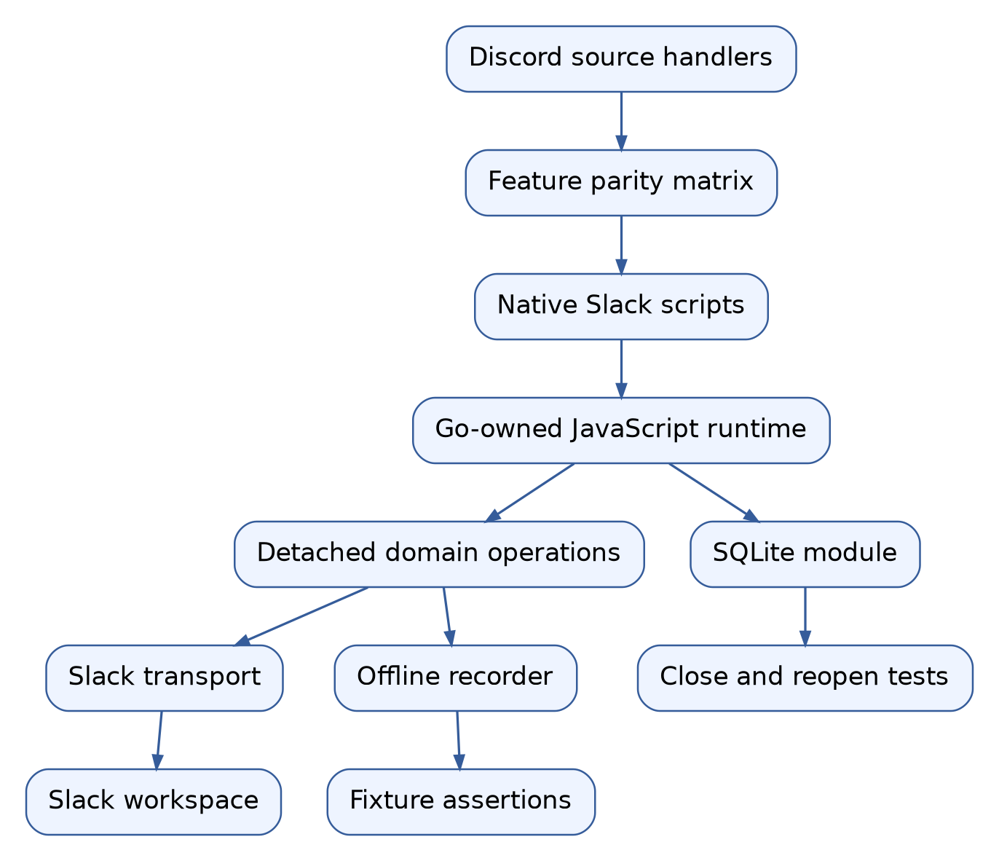
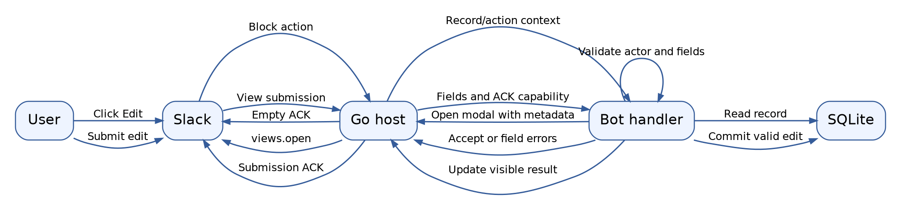

# Porting the Discord bot collection to native Slack workflows

## 1. Goal, completion rule, and first example

This ticket ports all 13 examples in `examples/discord-bots` to Slack. The
requirement is every feature for which Slack provides an equivalent. A directory
with a matching name is not completion. Each source workflow must either have
an executable Slack implementation and an acceptance test, or a documented
platform mismatch supported by a current API reference.

The initial development target is one local Go process running one JavaScript
bot. The developer can change the selected bot and synchronize the manifest of
the existing Slack app. The port must retain persistent storage where the
Discord example uses it, preserve permission checks on operational commands,
and distinguish simulated success from a live Slack qualification.

Consider the knowledge-base example. Its Discord workflow opens an entry form,
stores the submission in SQLite, and lets another command search or review it.
The Slack implementation must do those same application operations. It uses a
Slack modal and Block Kit messages instead of Discord forms and embeds. An
in-memory object with a similarly named search command would not preserve the
workflow: restarting the process would destroy the saved knowledge.

### Current checkpoint

The Slack runtime already supports commands, mentions, rich messages, button
actions, modal opening, text submission values, explicit acceptance/error ACKs,
offline recording and live Socket Mode. The checked-in ping and ui-showcase
examples have been exercised live. Initial announcements, hater,
interaction-types and unified-demo ports were checkpointed in `bf79512`.
Those four ports are incomplete against this ticket's stronger parity rule.

The user asked for the report first, followed by this design/upload and then
task-by-task implementation. The report was published to the go-go-parc vault
in commit `f5d7b60`. Subsequent implementation follows the numbered tasks here.

## 2. Vocabulary and system orientation

A **bot descriptor** is the local record created when a JavaScript entrypoint
registers handlers and configuration. A **Slack manifest** is the remote app's
configuration: slash commands, event subscriptions, permissions and display
information. A **profile** selects the management credential, app record and
workspace installation used by the local runner.

A **Slack invocation** is one normalized command, event or interactive callback.
An **ACK** acknowledges a Socket Mode delivery. An **application result** is
the separate effect of processing it: creating a record, posting a message,
changing a pin or returning a modal error. These effects must not be confused.
Accepting a modal closes its UI; it does not persist the submitted record.

A **surface** is a place where Slack displays an interaction, such as a message
or modal. **Block Kit** describes their layouts. A **block ID** identifies a
layout unit; an **action ID** selects an element handler; a modal's **callback
ID** selects its submission handler. All of these are strings, as are Slack
timestamps. Never convert a Slack timestamp into a floating-point number.



*Architecture diagram rendered with Graphviz for print readability.*

The architecture has two testable boundaries. Runtime tests verify that an
invocation chooses the right operation with the right data. Transport tests
verify that this operation becomes a valid Slack HTTP or WebSocket exchange.
Persistence tests reopen the actual database. None of these should require
posting administrative changes to the real workspace.

## 3. Code reading map

Start with `pkg/slackbot/model.go`. It defines the invocation kinds, message
payloads, modal views, service interfaces and stable errors. Next read
`internal/jsslack/module.go` for registration and
`internal/jsslack/dispatch.go` for invocation routing, asynchronous host
operations, state and reply ownership.

Read `internal/slacktransport/run.go` after understanding those types. It
decodes Slack envelopes and handles ACKs. `client.go` implements actual Slack
calls. `pkg/slackbot/recording.go` implements the same supported services as
inspectable offline effects. New services need corresponding live and test
implementations rather than special branches inside each bot.

The CLI lives in `pkg/slackcli`. `discover.go` inspects all candidate scripts,
`commands.go` generates manifests and executes operations, `run_remote.go`
resolves the selected profile, and `update_manifest.go` synchronizes app
configuration before connecting. `internal/slackconfig/store.go` separates
credential values from profile/app/installation metadata.

Finally, read the source bot itself, including its `lib` modules. The inventory
script `scripts/01-inventory.py` records 156 syntactically recognizable
registrations in `sources/discord-handlers.json`. This is an index, not a proof
of completeness: computed IDs, imported helpers and dynamically registered
handlers require source inspection.

## 4. Feature matrix by bot

### Announcements, ping and hater

The announcements example produces a preview from a root-level script.
Preserve that discovery pattern and the title/content fields using Block Kit.
Do not turn a preview into a channel broadcast. Tests should verify that its
only operation is the intended reply.

Ping is an API demonstration, not only a pong handler. Its source includes
echo, feedback forms, search/autocomplete, announcements and component examples.
Slack's corresponding controls must be demonstrated through commands, buttons,
modals, explicit posting and supported selection/option callbacks. An external
options callback is different from a Discord autocomplete interaction and
requires its own decoder and response payload.

Hater contains contempt reports, self/target roasts, reluctant compliments,
buttons, apology fields and message triggers. The initial Slack port is missing
target-user selection and complete apology response behavior. Preserve the
targeting choice using native user controls or parsed Slack user references.
For passive triggers, subscribe only to the message event kinds actually needed
and ignore the bot's own messages. Validation must not accept an empty apology
merely because the modal can close.

### Interaction types and unified demo

The interaction-types example exercises structured slash arguments,
subcommands, a user context operation and a message context operation. Slack
slash commands receive text; define and document a parser for `/fun roll 6`
instead of pretending typed Discord arguments exist. A Slack message shortcut
can implement quoting the selected message. Slack does not offer the same
user-context menu entry as Discord; an explicit user selector and user lookup
can preserve the avatar operation without claiming identical placement.

Unified-demo combines configuration with CLI verb metadata. Preserve the
configuration demonstration without echoing secrets. Its `__verb__` status/run
metadata is a separate CLI integration feature: a Slack slash status command
alone does not prove that integration has been ported. Either integrate with
the project's supported jsverbs path or record that work as outstanding.

### Poker

The poker library contains card parsing, deck construction, five-card scoring,
best-hand selection and Hold'em advice. These algorithms are largely platform
independent. Reuse their logic, while replacing Discord-specific state scoping
and renderers. Scope a game to workspace, channel and user so two players do
not overwrite each other.

Preserve deal, keep/redraw, score, reset, rank and action-advice commands,
the quick-action buttons, and the rank/advice forms. Validate duplicate cards,
invalid positions, repeated redraw and missing active game state. Modal
success must show a result through an explicit follow-up or a result view;
silently closing a scoring form loses an existing feature.

### Support

Support includes ticket preview/status and thread fetch/join/leave/start.
Slack threads are addressed by channel and root timestamp, not standalone
Discord thread channel IDs. A new Slack thread starts when the bot posts a
reply with `thread_ts`. Fetching uses `conversations.replies`. Do not equate
joining/leaving a Slack channel with joining/leaving a thread: establish an
actual platform counterpart before offering those operations.

The original deferred/edit/follow-up workflow requires both initial response
handling and later visible updates. A response URL replacement capability can
update an ephemeral interactive message; a normal channel message uses
`chat.update`. The API contract must make the chosen delivery mode explicit.

### Custom knowledge base and knowledge base

Custom-kb stores links, metadata and search results in SQLite. Port add/link,
search/list, selection/refresh and suggestion workflows with the same durable
semantics. URL and identity validation belongs in its store/domain functions.
Use parameterized SQL and test duplicate URL updates as well as fresh inserts.

Knowledge-base has more state: capture, teach/remember forms, aliases, source
references, verification/staleness/rejection, review queues, selected entries,
search pagination and exports. Read `lib/store.js`, `capture.js`,
`review.js`, `search.js`, and `reactions.js` before porting its entrypoint.
Slack source references use workspace, channel and message timestamp; Discord
message URLs must be replaced with Slack permalinks or equivalent stored source
identity.

Passive capture and reaction-triggered behavior require message and reaction
events. Keep source identity and review actor fields. Test that one workspace's
search cannot retrieve another workspace's records if the process or database
is shared. Do not preserve Discord column names without documenting their new
meaning; new Slack stores should use native names.

### Show-space

Show-space combines seed data, persistent show records, dates, role-based
authorization, announcement posting, pins, cancellation, archiving and
diagnostic commands. Port its pure date/catalog logic separately from Slack
rendering and transport. Keep show state durable and preserve links to posted
announcements using channel and timestamp strings.

Discord roles do not have identical Slack permissions. Configure allowed
operator IDs and, where appropriate, explicit Slack user-group IDs. A matching
user-group name is not proof of authorization. The debug workflows should
explain resolved memberships and configured IDs without printing secrets.
Do not let missing configuration default to unrestricted writes.

Announcement operations must use the returned message reference directly for
pinning. Avoid the Discord example's fallback of listing recent messages and
guessing the newly posted one: Slack's post response supplies the timestamp.

### Archive helper and moderation

Archive-helper needs paginated channel/thread history, chronological rendering,
source links and file output. Preserve author/time metadata and Markdown
escaping. Stop pagination at the requested boundary or limit, handle empty
pages, and keep cursors opaque. The existing Discord helper's `before` snowflake
pagination does not translate directly into Slack's cursors and timestamp
filters.

Slack file upload uses an external-upload sequence: request an upload URL,
send bytes, then complete the upload. Archive generation must not stop at a
message saying an archive was created; acceptance includes verifying the
uploaded file content in the transport mock.

Moderation must distinguish lookup, bot-owned message changes, channel
operations and workspace administration. Slack's `chat.delete` with a bot
token can delete only that bot's messages; it cannot implement arbitrary
Discord bulk deletion. User groups are not Discord roles. Workspace removal
has an Enterprise/admin API with different credentials; channel kicking is
a different action. Do not silently replace workspace bans/timeouts with
channel removal.

| Discord family | Native Slack operation or boundary |
| --- | --- |
| Guild/member info | Workspace/team and users APIs. |
| Channel info/topic | Conversations info and setTopic. |
| Pin/unpin/list pins | pins.add, pins.remove, pins.list. |
| Fetch message/history | Conversations history/replies with explicit access constraints. |
| Delete messages | Own-message chat.delete; wider moderation is not granted by bot token. |
| Role membership | Explicit user-group workflow only where its semantics fit. |
| Kick workspace member | Admin users removal where plan and admin user token permit. |
| Ban/unban, timeout, channel slowmode | No assumed equivalent; document exact supported counterpart or lack of one. |

The message-delete restriction is documented in the [chat.delete
reference](https://docs.slack.dev/reference/methods/chat.delete/). The
[admin.users.remove reference](https://docs.slack.dev/reference/methods/admin.users.remove/)
requires an Enterprise plan and an appropriate user token. Implementing an
admin call does not authorize exercising it against the user's real workspace.

### UI showcase

The existing Slack showcase is the smallest message/button/modal demonstration.
The Discord showcase also contains search, review selection, pagination,
cards, confirmations, select variants and aliases. Recreate those workflows
with Slack-native layouts and stable state IDs. Use user/conversation selects
where the source asks for those entities. Role and mentionable controls need
an explicitly documented semantic decision, not a mislabeled Slack control.

## 5. Proposed framework extensions

This section is a proposed API contract, not a statement that these methods
already exist. Implement small capabilities as each port needs them. Keep Go
SDK values and credentials private.

### Message operations

Add explicit domain services for updating/deleting channel messages,
ephemeral replies, response replacement, pins and conversation reads.
Use channel/timestamp pairs and detached message payloads. Keep response URL
replacement on the invocation capability; never expose the secret URL.

```javascript
// Proposed API; implement and test before using in bot examples.
await ctx.slack.messages.update({channelId, ts, text, blocks});
await ctx.slack.messages.remove({channelId, ts});
await ctx.replaceReply({text, blocks});
const page = await ctx.slack.conversations.history({
  channelId, cursor, limit: 100
});
```

Service errors must distinguish missing scope, missing membership, rate limiting
and unknown delivery outcome. Avoid unconditional retries on writes. For read
pagination, expose enough error information for a user to retry intentionally
rather than adding a generic job scheduler.

### UI and interaction routing

Extend builders for static/user/conversation selects, context/image blocks,
link buttons, confirmations and multiline text input. Fix optional-input
placement. Add selectors to action blocks only when their allowed surface
rules are understood. Submitted values require typed helpers for selected
options/users/conversations, not an assumption that every field has `value`.

Add global/message shortcut registration and decoding. Their callback IDs
select handlers and their trigger IDs can open modals. External options
requests need a response-bearing ACK with the options payload. Their lifecycle
must be tested independently from normal button actions.

Keep the current Go-owned receipt model. New ACK payload variants belong in
its explicit response type and validation. Do not restore the deferred worker
reservation/priority scheduler under the pretext of implementing selects.

### Database and runtime capabilities

The pinned go-go-goja module includes a database module:
`modules/database/database.go`. Inspect its constructor, configuration,
transaction support and close behavior before registering it for Slack.
Register only the intended module rather than enabling every implicit module.

Inspection must remain free of database mutations. Stores should initialize
lazily on a real invocation or explicit runtime setup, and simulation should
use a test database. Close the database when the host closes. Reopening a
temporary file in a second host is the acceptance test for persistence.

### Permissions and credentials

Descriptors need explicit additional scopes and event subscriptions.
Generate bot scopes from declared capabilities and verify manifests in tests.
Admin/user-token methods must not reuse a bot token accidentally. Store an
optional user/admin credential separately if the implemented counterpart needs
it, and choose credentials in Go by service method.

The manifest is remote state. Startup already updates it by default and reports
changed permissions. Treat missing installed scopes as an operational failure
with an install instruction; do not fabricate successful API results.

## 6. Concrete data-flow examples

A review button needs both routing identity and record identity. Put a stable
handler name in the action ID and the record ID in the value. Verify workspace
and authorization before changing the record. Build the next UI from the
updated application state.

```text
on review.verify(action):
    entryID = parse action.value
    actor = invocation.userId
    entry = store.load(workspace, entryID)
    reject missing entry or unauthorized actor
    store.markVerified(workspace, entryID, actor)
    nextView = renderReview(store.currentQueue(workspace))
    replace originating message with nextView
```

For a modal edit, private metadata can identify the original record and message.
It is application context, not proof of authorization. Revalidate the record
and actor on submission. A process restart may remove transient UI state; a
clear reopen instruction is sufficient.



*Review/edit sequence rendered with Graphviz for print readability.*

The ordering of acceptance and persistence is an application decision. A short
local transaction may finish before acceptance; a slow operation should accept
promptly and report later failure explicitly. Do not hold the ACK indefinitely
during history retrieval or file upload.

## 7. API reference and archived evidence

The ticket's sources folder contains Defuddle extracts plus URL/hash metadata
in `index.json`. Some generated documentation omits method fact tables during
extraction; confirm token types/scopes against the linked official page when
implementing a service. The source inventory JSON points back to local source
files and line numbers.

| API family | References | Implementation focus |
| --- | --- | --- |
| History and threads | conversations.history, conversations.replies | Cursor pagination, timestamp strings, access/token constraints. |
| Message mutation | chat.update, chat.delete, chat.postEphemeral | Ownership, ephemerality, delivery semantics. |
| Identity and groups | users.info, usergroups.users.update | Resolve identity; full group replacement is not append. |
| Channel operations | conversations.kick, conversations.setTopic | Channel permissions and actor authorization. |
| Pins | pins.add/remove/list | Channel/timestamp target; preserve posted reference. |
| Files | files.getUploadURLExternal, files.completeUploadExternal | Obtain URL, send bytes, complete and share. |
| Reactions | reactions.add; reaction_added event | Emoji name and message identity. |
| Administration | admin.users.remove | Enterprise/admin user credential requirements. |
| Shortcuts | implementing-shortcuts | Global vs message context and modal trigger. |
| Block Kit | block-elements reference | Per-element payload and allowed surface. |

Full URLs and archived filenames are enumerated in `sources/index.json`.
The public [shortcuts guide](https://docs.slack.dev/interactivity/implementing-shortcuts/)
distinguishes global shortcuts from message shortcuts. This is the basis for
porting the message-context workflow without inventing a Discord interaction
type in the Slack runtime.

## 8. Implementation tasks and acceptance gates

Work in dependency order. Each task ends with source, tests, documentation and
a diary checkpoint. Commit a coherent capability or bot workflow; avoid one
commit per cosmetic edit.

1. **Baseline and parity matrix.** Inspect all 156 indexed registrations and
   imported helpers. Add a row for each workflow with proposed Slack behavior,
   source file, scopes, test and status. The current bot-family matrix is the
   starting point, not the final acceptance checklist.
2. **Native UI correctness and controls.** Fix optional inputs and add required
   selects/confirmations/multiline controls. Prove nested payload shapes and
   snapshot behavior in Goja tests.
3. **Interaction completion.** Implement command-trigger modal opening,
   shortcuts, external options, response replacement and explicit modal result
   handling. Test deadlines and response-bearing ACKs with real SDK fixtures.
4. **Operational services.** Add message updates, identity/channel/history,
   pins/reactions and file upload. Tests assert HTTP request bodies, cursor
   propagation, token selection and permission failures.
5. **Persistent host capability.** Register the database module with lifecycle
   ownership and lazy store initialization. Prove inspect does not write and
   records survive closing/reopening a runtime.
6. **Simple and game bots.** Finish announcements, ping, hater,
   interaction-types, unified-demo and poker, including every equivalent
   interaction from the inventory.
7. **Data bots.** Port custom-kb and knowledge-base with durable state,
   review/search workflows and source references.
8. **Operational bots.** Port support, show-space, archive-helper and moderation
   with explicit platform differences and authorization.
9. **Showcase and qualification.** Complete the UI showcase parity matrix,
   update declarations/help/README, run all bot discovery/manifest/fixture
   checks and document remaining plan/token-dependent live tests.

A bot is complete only when its matrix has no unexplained missing equivalent.
A conditional Enterprise API implementation can be tested with a transport
mock and marked “live qualification requires Enterprise/admin token”; that is
different from an absent implementation.

## 9. Tests that prove behavior

Use unit tests for pure card/date/formatting logic, host tests for routing and
state, transport fixtures for Slack encoding, and integration tests for a
representative multi-invocation workflow. Do not merely assert that a bot
inspects: inspection executes declarations but does not exercise handlers.

A knowledge-base acceptance test creates a temporary SQLite file, submits a
record, closes the host, opens another host against the same file, searches,
reviews and exports the record. A poker test deals a game, redraws selected
cards once and rejects a second redraw. A show-space test asserts that an
unauthorized actor produces zero write operations.

An archive test supplies two history pages, verifies cursor propagation,
renders the complete chronological output, and checks the bytes sent through
the external-upload sequence. A moderation test must prove bot-owned deletion
constraints rather than simulate arbitrary-message deletion success.

Run live tests only for explicitly authorized operations. Creating this ticket
and implementing administrative methods does not authorize banning users,
deleting real messages or publishing announcements. Offline mocks provide
meaningful coverage without performing those operations.

## 10. First commands for an intern

From the repository root:

```sh
GOWORK=off go run ./cmd/slack-bot help slack-bot-guide
GOWORK=off go run ./cmd/slack-bot help slack-ui-dsl
GOWORK=off go run ./cmd/slack-bot bots list
GOWORK=off go run ./cmd/slack-bot bots inspect ui-showcase
GOWORK=off go run ./cmd/slack-bot bots simulate ui-showcase \
  --event-file examples/slack-bots/fixtures/ui-view.json
GOWORK=off go test ./internal/jsslack ./pkg/slackcli
```

On this workstation use `GOCACHE=/tmp/go-build-cache-slack-ui` if the normal
cache is not writable. Local network fixture tests need loopback binding.
Long-lived runners belong in tmux. Use explicit profile and bot names and
inspect startup logs before interpreting a Slack response.

Keep the detailed diary in `reference/01-implementation-diary.md`. Record
actual failures, test boundaries and commit revisions. Update the parity
matrix when a workflow becomes implemented, not when a directory is created.
